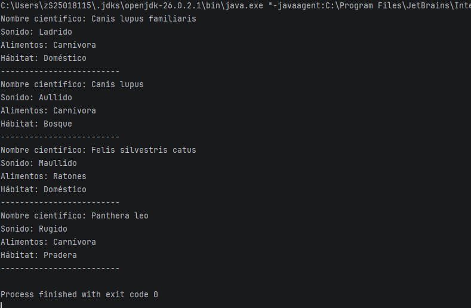

# Actividad 4 - Jerarquía de Animales

Ejercicio de Java sobre clases abstractas, herencia y polimorfismo.

## Clases

- Animal
- Canido
- Felino
- Perro
- Lobo
- Gato
- Leon

El programa utiliza un arreglo de tipo `Animal` para mostrar los datos de cada animal.

